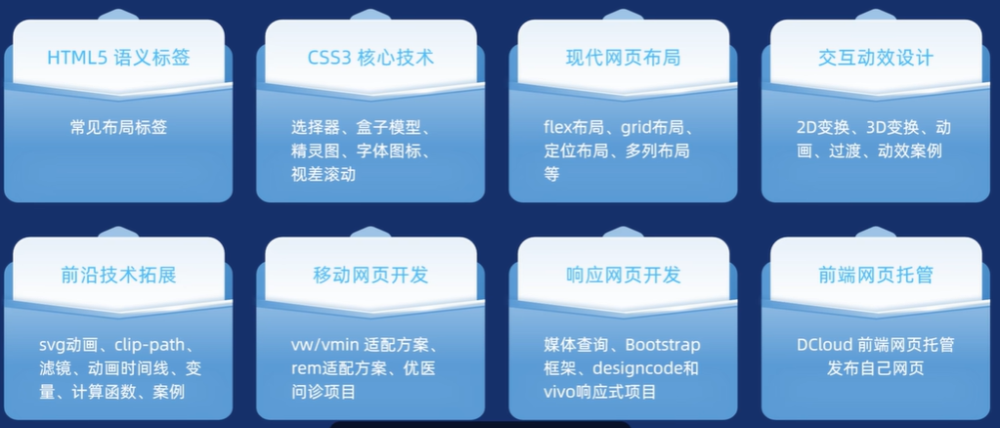

# 摘要

2025版Pink老师AI+前端入门教程，涵盖HTML5、CSS3、FlexGrid布局、响应式设计、移动端开发及Bootstrap5框架，结合AI工具提升开发效率，新增弹幕优化学习体验，并通过八大模块系统讲解PC端与移动端项目实战，最终实现网页托管部署，助力零基础学员高效掌握前端技能。

# 8大板块

# 开发工具

trae：<https://www.trae.ai/>

chrome：<https://www.google.com/chrome/>
